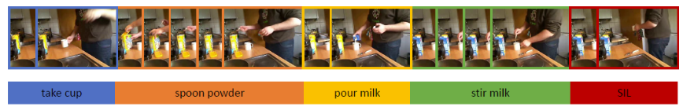
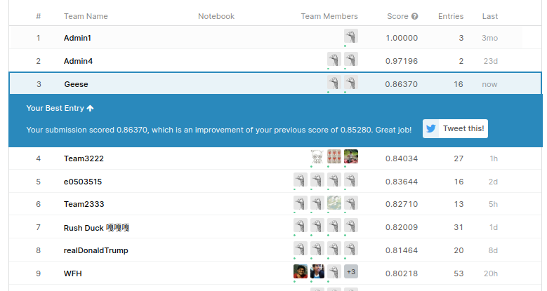

# CS5242 Project: Fine-Grained Breakfast Action Recognition


This is the project directory for our CS5242 Project which is a Kaggle competition [here](https://www.kaggle.com/c/cs5242project/leaderboard). 
We achieve the top performance (first two entries are admins) by adding boundary priors and coarse label priors to I3D features and using
the implementation of MSTCN. 



Credits to the authors of MS-TCN:
```bash
Y. Abu Farha and J. Gall.
MS-TCN: Multi-Stage Temporal Convolutional Network for Action Segmentation.
In IEEE Conference on Computer Vision and Pattern Recognition (CVPR), 2019
```

## Setup 
First setup your repository like the following:

```
[PROJECT_ROOT_DIR]
    - [PROJECT_DIR] # this code base
    - datasets
        - breakfast
            -  mstcn  # download from mstcn: https://github.com/yabufarha/ms-tcn
                - features
                - groundTruth
                - mapping.txt
                - splits
                - segment-labels  # gdrive
            - test_segment.txt # gdrive
            - test-segment-gt.txt # gdrive
            - splits # gdrive
    - submissions
    - unaware-submissions
```
Then go to `[PROJECT_DIR]/src/config.py` and add your `[PROJECT_ROOT_DIR]` to `_POSSIBLE_ROOT_DIRS`. The Google Drive 
link is [here](`https://drive.google.com/drive/folders/1LoNS6GcMwqdrt3NrgzisRe_7hnDSt2bH?usp=sharing`). 

To download dependencies, simply run `pip install -r requirements.txt` inside the `[PROJECT_DIR]`. We run this in a conda environment with 
`python==3.7.6`

## Training:

To perform training, you can download our config files from our Google Drive link and place it into `[PROJECT_DIR]/configs/`. 
Then, you can run the following command in `scripts/action-segmentation/`. To train our best model (final submission):
```
python src/scripts/action_segmentation/train_coarse_inputs_boundary_true.py -c train-longer -d 0
```

To train our best coarse label only model (ablation and unaware submission), run:
```
python src/scripts/action_segmentation/train_coarse_inputs.py -c bz8-samelr-fmap-128 -d 0
```

To train our best coarse label + boundary model (ablation), run:
```
python src/scripts/action_segmentation/train_coarse_inputs_boundary_true.py -c base -d 0
```

## Predictions
To perform predictions, run the following line, the following will produce a prediction stored at 
`[PROJECT_ROOT_DIR]/submissions/action-segmentation/coarse-inputs-boundary-true/train-longer`, which has 
`frame-level-predictions`, which contain our temporal segmentation predictions, and `submission.csv`,
which can be evaluated on the Kaggle leaderboard. 

Note: if unsure, check how we perform prediction for boundaries, we use the segment timestamps to create boundary logits 
and do not use actual test labels. But we use test labels to create boundaries during training script just for ease of 
coding, and cleaner scripts.

```
python src/scripts/action_segmentation/create_submission.py -m coarse-inputs-boundary-true -c train-longer -d 0
```

For our segment-unaware predictions in `[PROJECT_ROOT_DIR]/unaware-submissions/action-segmentation/coarse-inputs/bz8-samelr-fmap-128`, use
```
python src/scripts/action_segmentation/create_submission.py -m coarse-inputs -c bz8-samelr-fmap-128 -d 0
```

## Pretrained Models:

Download our pretrained models from the Google Drive links, we only provide models for the training scripts mention above, 
other models take up too much space. Run the prediction scripts after placing the pretrained models into the 
`[PROJECT_DIR]/checkpoints/` directory:

## Extras:
### Notify Utilities:
Get telegram to notif you. First communicate with botfather and create your bot using `/newbot` command. 
Update the bot token in `utils/notify_utils.py` and visit the following URL for the chat id 
after sending one message to your bot.

```
https://api.telegram.org/bot<TOKEN>/getUpdates
```

Update the chat-id inside `utils/notify_utils.py` as well.

### Downloading Video Codecs

```bash
sudo apt update
sudo apt install libdvdnav4 libdvdread4 gstreamer1.0-plugins-bad gstreamer1.0-plugins-ugly libdvd-pkg
sudo dpkg-reconfigure libdvd-pkg
sudo apt install ubuntu-restricted-extras
conda install -c conda-forge ffmpeg
```


### Kinetics
To download kinetics dataset, create `{DATA_DIR}/kinetics/splits` and place the downloaded `.json` and `.csv` 
downloaded from [Kinetics-400](https://deepmind.com/research/open-source/kinetics) into the folder.

```bash
# {split} is one of ['train', 'test', 'val']
python src/extras/download_kinetics400.py --split {split} 
```

### ActivityNet

To download activity-net 1.3, download `youtube-dl` first:
```bash
sudo apt-get install youtube-dl
```
Then, run the following:
```bash
python src/extras/create_anet_download_script.py
cd {DATA_DIR}/activitynet/
bash ./download-anet13.sh
```

### Other Repositories:
```bash
https://github.com/Kennard123661/cs5242-project  # CSNet Pytorch
https://github.com/lusindazc/CS_5242_projects  # ssdta and misc
https://github.com/lusindazc/CS_5242_feat  # I3D
```

